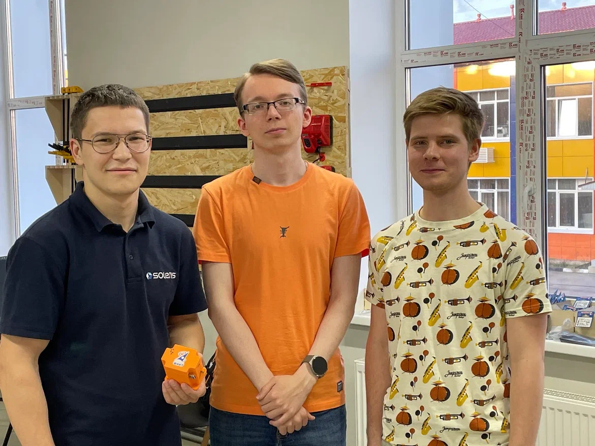
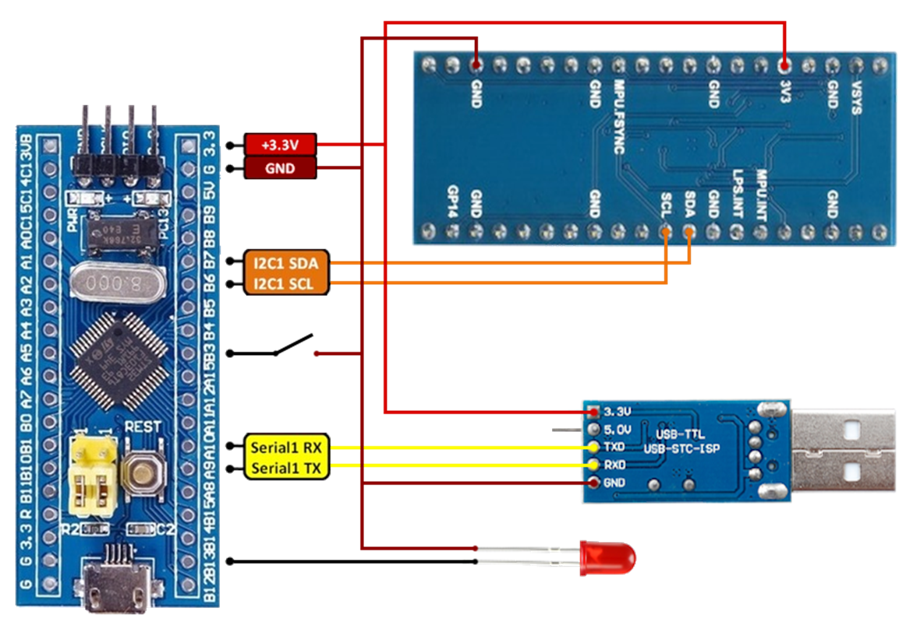
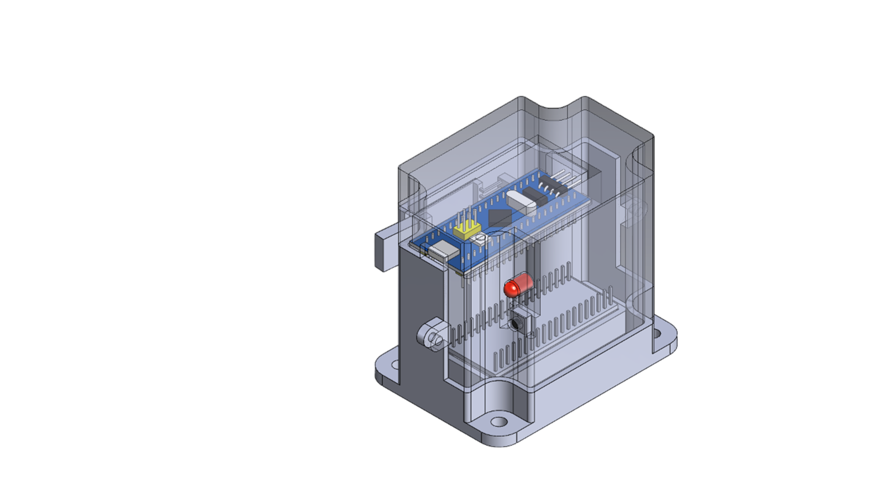
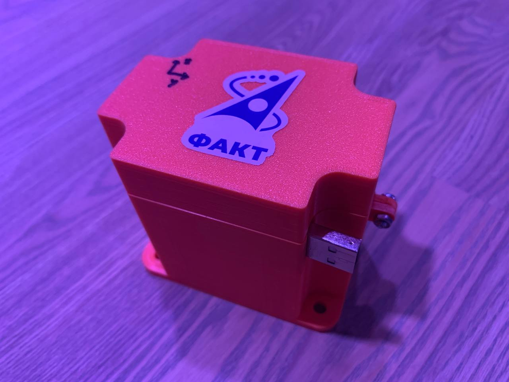

                            ХАКАТОН ANTLAB

ЗАДАЧА

    Откалибровать mpu9250, представить откалиброванный датчик ввиде устройства

ВРЕМЯ ДЛЯ РЕШЕНИЯ ЗАДАЧИ

    72 часа

КОМАНДА:

    Бунаков Егор - программист
    Волков Роман - конструктор
    Сутурин Даниил - программист

ИНТЕРФЕЙС УСТРОЙСТВА:

    Кнопка для переключения режимов калибровки:
    ->короткое нажатие - сдвиг нуля гироскопа
    ->длинное нажатие - калибровка одного направления одной оси магнитометра
    Светодиод:
    -> указывает режим работы

ПРИНЦИПИАЛЬНАЯ СХЕМА УСТРОЙСТВА:

МОДЕЛЬ SOLIDWORKS:

ФОТО УСТРОЙСТВА:

ВИДЕО КАЛИБРОВКИ МАГНИТОМЕТРА:
    [https://www.youtube-nocookie.com/embed/URL](https://youtu.be/XUBhtNs30_Q?si=Yyp379JpWxNiqINJ)

НЕ РЕАЛИЗОВАННАЯ КАЛИБРОВКА МАГНИТОМЕТРА:
    https://github.com/ibrahimcahit/MPU9255-Quaternion-AHRS-STM32